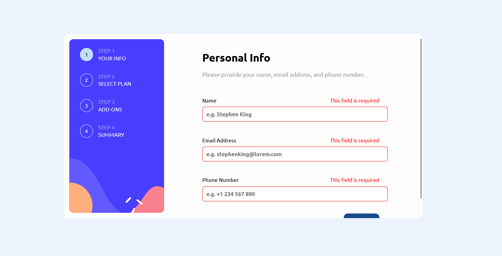
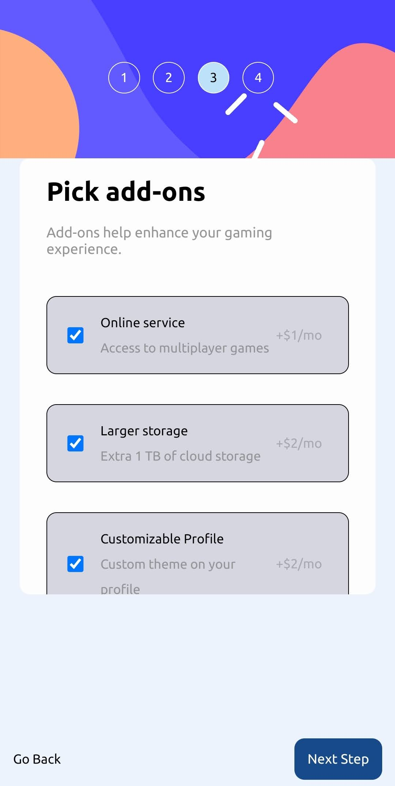

# Frontend Mentor - Multi-step form solution

This is a solution to the [Multi-step form challenge on Frontend Mentor](https://www.frontendmentor.io/challenges/multistep-form-YVAnSdqQBJ). Frontend Mentor challenges help you improve your coding skills by building realistic projects. 

## Table of contents

- [Overview](#overview)
  - [The challenge](#the-challenge)
  - [Screenshot](#screenshot)
  - [Links](#links)
- [My process](#my-process)
  - [Built with](#built-with)
- [Author](#author)
- [Acknowledgments](#acknowledgments)

## Overview 

### The challenge

Users should be able to:

- Complete each step of the sequence
- Go back to a previous step to update their selections
- See a summary of their selections on the final step and confirm their order
- View the optimal layout for the interface depending on their device's screen size
- See hover and focus states for all interactive elements on the page
- Receive form validation messages if:
  - A field has been missed
  - The email address is not formatted correctly
  - A step is submitted, but no selection has been made

### Screenshot

### Links

- Solution URL: [GitHub](https://github.com/Stefan3002/Frontend-Mentor-Multi-Step-Form)
- Live Site URL: [Web App](https://thriving-beignet-17d103.netlify.app/)

## My process

### Built with

- React Js.
- Sass
- Redux

## Author

- Website - [Stefan Secrieru](https://dreamy-crisp-8754c8.netlify.app/)
- Frontend Mentor - [Stefan3002](https://www.frontendmentor.io/profile/Stefan3002)
- LinkedIn - [Stefan Secrieru](https://www.linkedin.com/in/%C8%99tefan-secrieru-b0b60b224/)

## Acknowledgments

The regex used for the e-mail validation is taken from here:
https://www.w3resource.com/javascript/form/email-validation.php
Many thanks!
